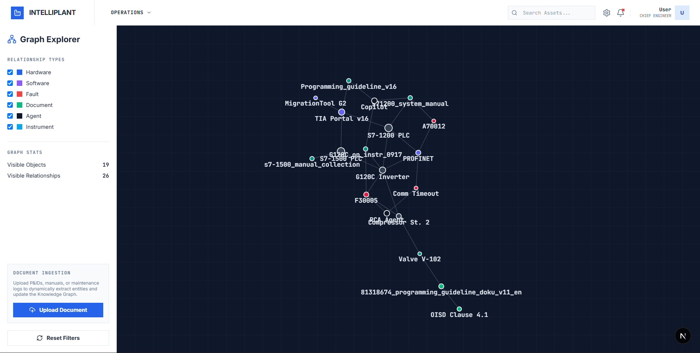
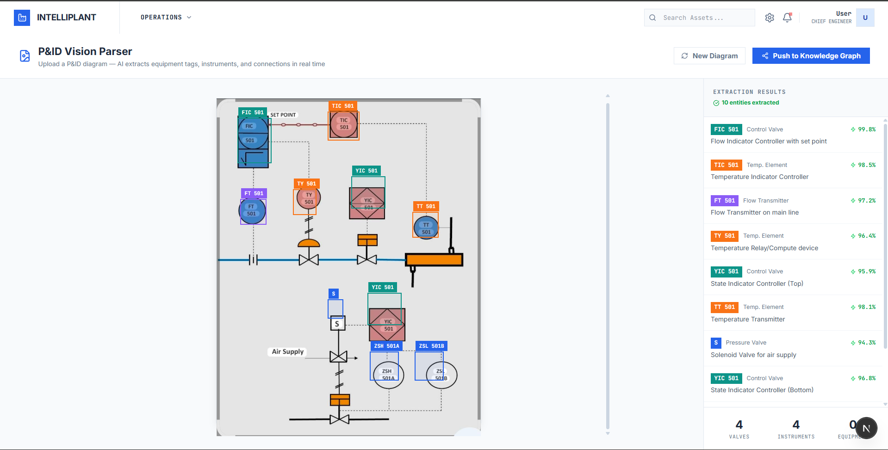
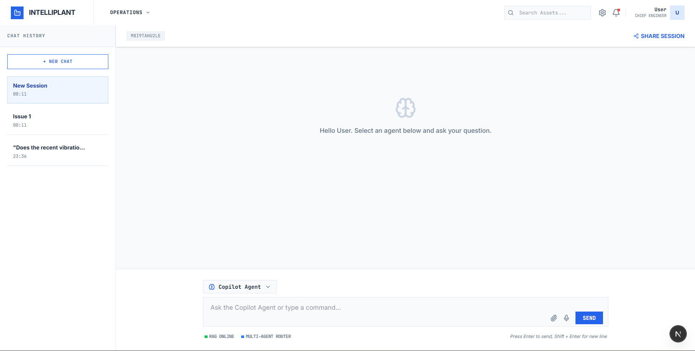
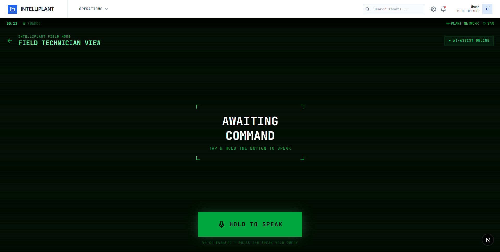

<div align="center">
  <h1>IntelliPlant 🏭</h1>
  <p><strong>An AI-Powered Industrial Operating System</strong></p>
  <p>Bridging the gap between legacy engineering data and real-time operational decision making.</p>
</div>

<hr />

## 🚀 Overview

IntelliPlant is a state-of-the-art, multi-agent platform designed specifically for heavy industry. It features a Next.js Executive Dashboard paired with a highly performant, multi-agent FastAPI backend. 

By combining spatial AI vision parsing, dynamic ontology graphs, and multi-agent AI, we are redefining how industrial facilities operate, keeping workers safe and operations efficient.

## 📸 Screenshots

### 1. Dynamic Knowledge Graph
*Dynamically maps relationships between hardware, faults, agents, and documentation in a live, physics-based environment.*


### 2. P&ID Vision Parser
*Instantly digitizes legacy engineering diagrams, automatically extracting components and control loops with high confidence.*


### 3. Multi-Agent AI Chat
*Seamlessly routes queries to specialized AI agents (Root Cause Analysis, Compliance, or Copilot) based on engineering context.*


### 4. Field Tech Voice Interface
*A hands-free, dark-mode copilot designed for extreme environments. Allows technicians to query the Knowledge Graph using voice commands for actionable, step-by-step procedures.*


## ✨ Key Features

*   **Multi-Agent Routing Architecture:** Automatically routes natural language queries to specialized AI agents depending on the engineering context.
*   **P&ID Vision Parser:** Utilizes advanced LLM vision capabilities to instantly extract piping, instruments, and equipment tags from uploaded engineering diagrams.
*   **Dynamic Knowledge Graph:** Automatically ingests P&ID data and heterogeneous documents into a live Ontology Graph, creating semantic links.
*   **Field Tech Voice Interface:** A hands-free, dark-mode mobile interface designed for field technicians to query systems and run diagnostics using voice commands.
*   **RAG Document Pipeline:** Rapidly retrieves domain context from uploaded industrial PDFs and CSVs using vector store integration.

## 🛠 Technology Stack

*   **Frontend:** Next.js 14, React, Tailwind CSS, Lucide Icons, Force-Graph 2D
*   **Backend:** Python 3, FastAPI, Uvicorn, LangChain, ChromaDB
*   **AI Models:** gemma4:12b (via Ollama)

## 📦 Getting Started

### Prerequisites
*   Node.js (v18+)
*   Python 3.10+
*   Ollama (with gemma4:12b model pulled)

### Local Development

**1. Clone the repository**
```bash
git clone https://github.com/VedR07/Encoder-Industrial-Platform.git
cd Encoder-Industrial-Platform
```

**2. Setup Backend**
```bash
python -m venv venv
source venv/bin/activate  # On Windows use `venv\Scripts\activate`
pip install -r requirements.txt
python main.py
```
The backend API will run on `http://localhost:8000` with Swagger docs available at `http://localhost:8000/docs`.

**3. Setup Frontend**
```bash
cd frontend
npm install
npm run dev
```
The frontend dashboard will run on `http://localhost:3000`.

## 📂 Project Structure

*   `/frontend` - The Next.js web application (Dashboard, Graph Explorer, P&ID Parser, Field Tech UI).
*   `/app` - The FastAPI backend core logic, agent routers, vector store logic, and API endpoints.
*   `/datasets` - Local directory for ingesting PDF manuals and operational data.
*   `main.py` - The FastAPI application entrypoint.

## 🛡 License
This project is proprietary and intended for demonstration purposes.
